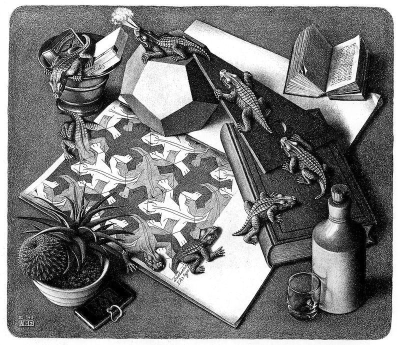
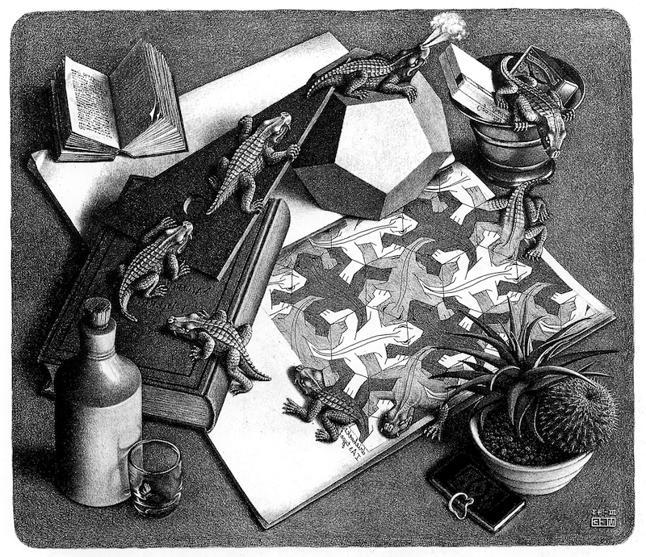

# ImageEditor

This tool supports processing PNG images and applying various manipulations through multiple scripts. For example, ImageEditor allows you to apply grayscale effects, mirror images, crop them, and much more. My editor can also be used to convert PNG to XPM2 format.

## How to use

```bash
    make all
    ./test <test> or ./test # run all tests
```

**For example**:

**Input**


**Test**
```bash
./test h_mirror4 # Test horizontal mirror
``` 

**Output**



## Implementation and Features

### Color

ImageEditor uses RGB color with **8 bits** per channel.

**Files**
- **[Color.hpp](include/Color.hpp):** Header file defining the Color class.
- **[Color.cpp](src/Color.cpp):** Implementation of the Color class.

### Image

To create an image, three variables are required: the **width**, **height**, and a **color** to fill all pixels (width × height).


**Files**
- **[Image.hpp](include/Image.hpp):** Header file defining the Image class.
- **[Image.cpp](src/Image.cpp):** Implementation of the Image class.


### Script

Inside of the script file, contains various functions that can manipulate the image.


